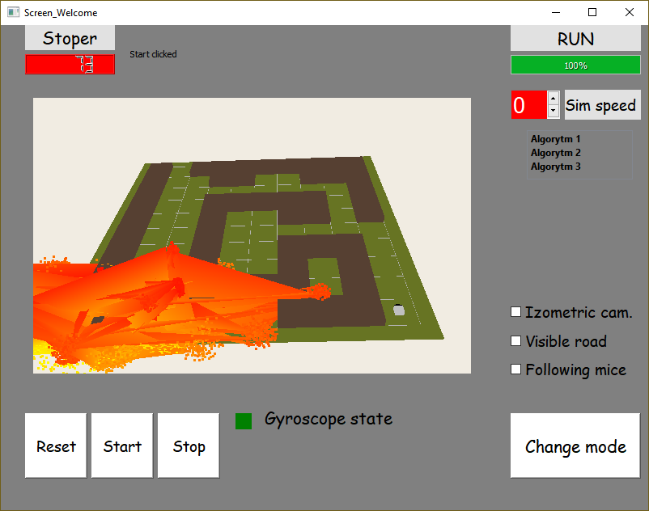

# Wezuwiusz

The aplication shows a vulcano eruption in Qt lirary, addisonally aplication allows control the vulcano by phone using UDP protocol. The phone sends a data from accelerometr allowing vulcano's movment. Bellow two screens first shows the simulation window after start, second shows the vulcano eruption.

